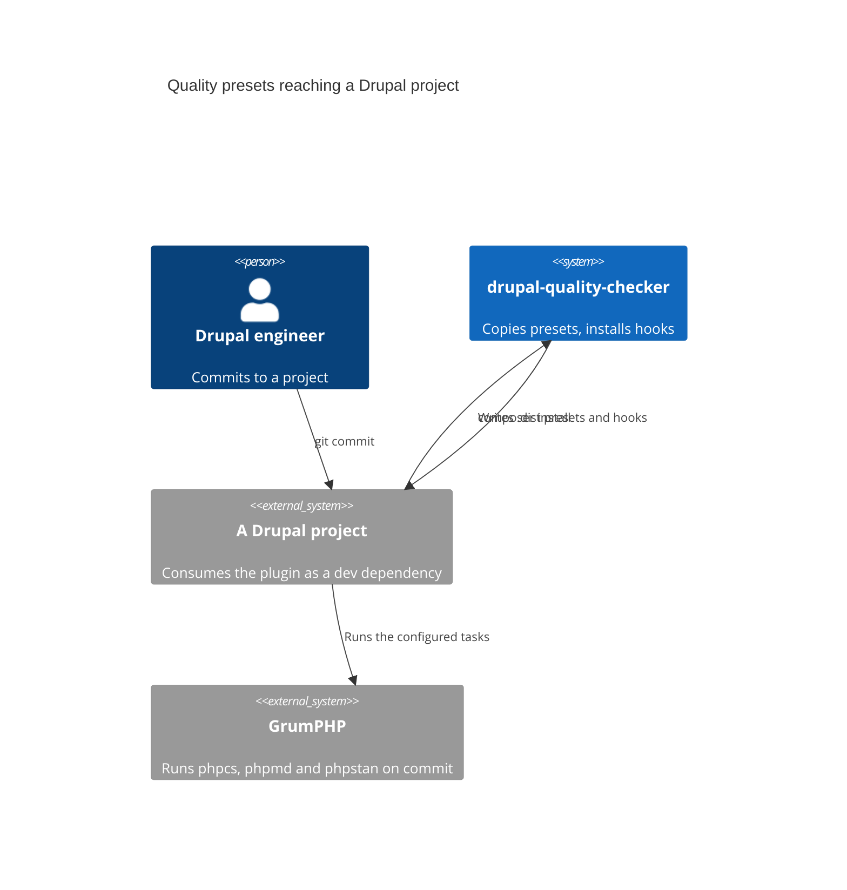

# Architecture

## Context

A Composer plugin. It runs during `composer install` in a consuming Drupal
project, copies Axelerant's quality presets in, and installs the git hooks that
enforce them. It has no runtime of its own.

## How it fits together

`src/` is the plugin that Composer loads. `resources/` holds the files copied
into the consuming project. A new preset needs an entry in both, and the copy is
unconditional: `.dist` files are overwritten on every `composer install`, which
is what keeps a project's presets current and why a project that wants to
diverge renames them.

The presets themselves are the interface. Changing a rule in `phpcs.xml.dist`
changes the build of every project that installs this plugin, so a rule change
is a release rather than an edit.

## What we did not do

The presets could ship as a GrumPHP extension rather than copied files, which
would remove the overwrite behaviour and the rename dance. Copying was kept
because a project can read and diff the files it actually uses, and because an
extension would hide the rules inside a dependency where nobody looks at them.
